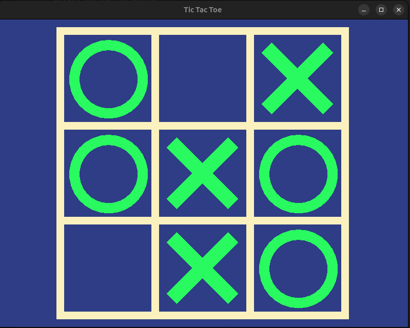

# Tic-tac-toe

This is a simple tic-tac-toe game implemented in C++ using SMFL library.

## Built and run

Use `cmake CMakeLists.txt` and `make` commands to build a project. Then run built file.

**Important**: You should install all `SFML` dependencies to avoid errors during the build.

